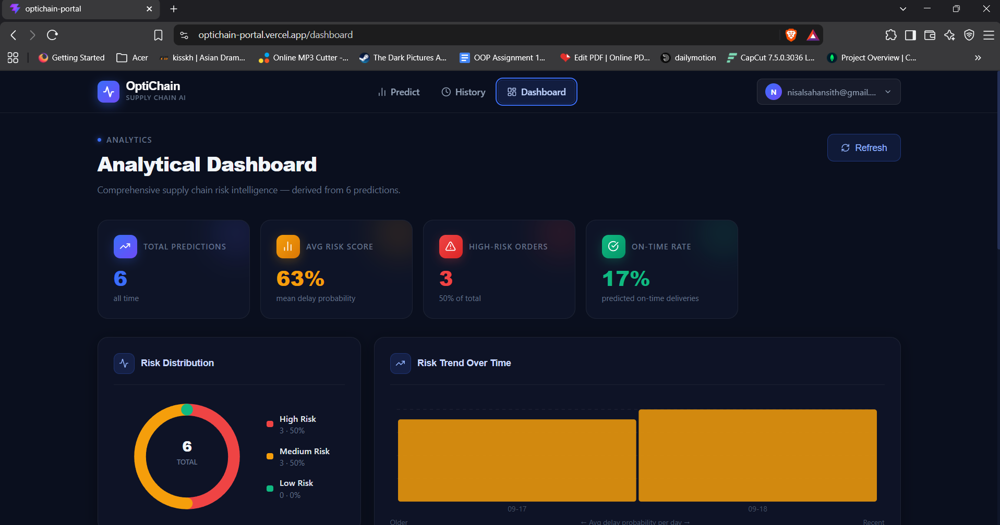
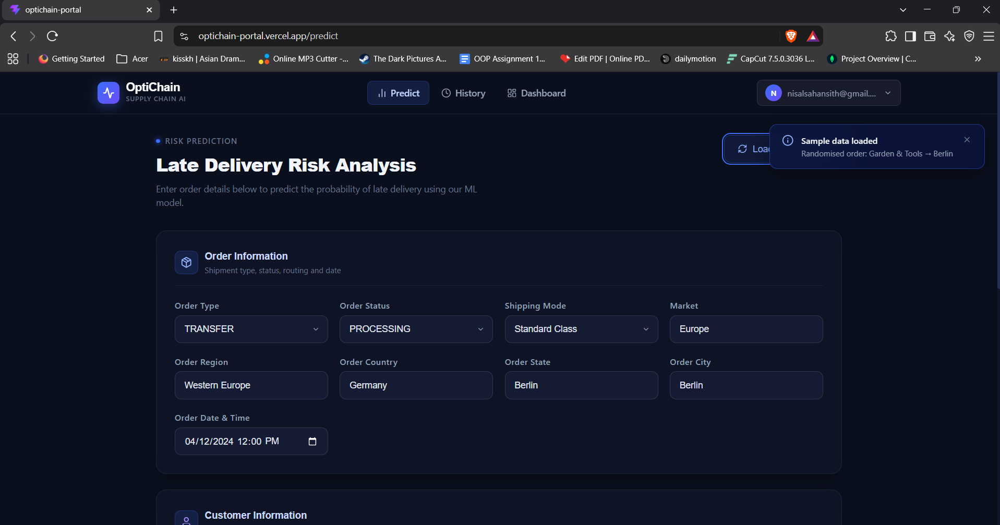
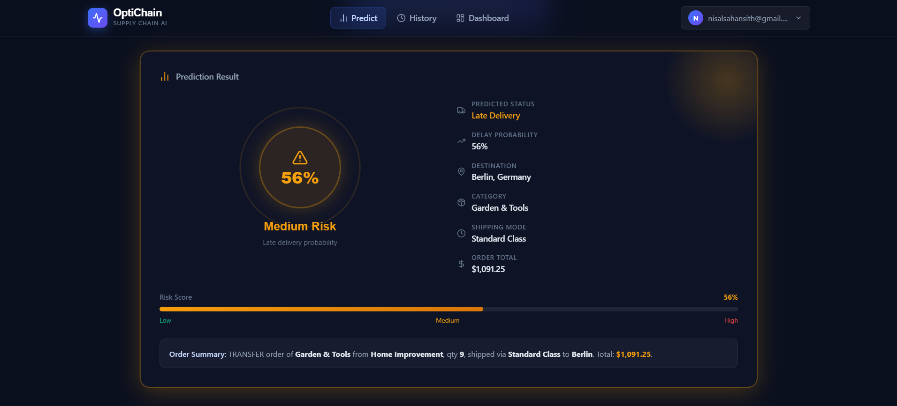
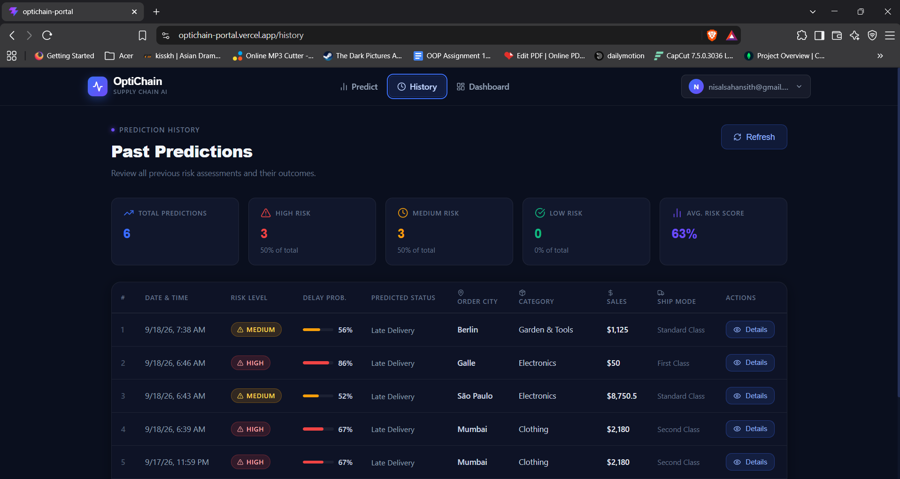

# OptiChain Platform

> **AI-powered supply chain delivery risk prediction platform**

OptiChain is a full-stack machine learning application designed to help supply chain operations identify and analyze potential late-delivery risks.

The platform combines a React-based analytics dashboard, a FastAPI backend, MongoDB-based data storage, JWT authentication, and machine learning models built with Scikit-Learn and XGBoost.

Developed as a group project for the **GDSE Machine Learning Module**.

---

## 🚀 Live Application

### Frontend

**OptiChain Portal**

https://optichain-portal.vercel.app

### Backend API

**FastAPI Backend**

https://optichain-backend-427525760401.us-central1.run.app

### API Documentation

**Swagger UI**

https://optichain-backend-427525760401.us-central1.run.app/docs

---

## ✨ Features

* 📊 Supply chain analytics dashboard
* 🤖 Machine learning-based late-delivery prediction
* 📦 Supply chain order analysis
* 🔐 JWT-based authentication
* 👤 User registration and login
* 📈 Prediction probability and risk status
* 🕒 Prediction history tracking
* 📚 Interactive Swagger API documentation
* 🌐 Full-stack web application
* ☁️ Cloud-deployed backend and frontend

---

## 📸 Application Screenshots

### Dashboard

The dashboard provides an overview of the supply chain prediction system and key operational information.



### Delivery Risk Prediction

Users can submit supply chain information and receive a machine learning prediction indicating the probability of a late delivery.





### Prediction History

The prediction history interface allows users to review previously generated delivery-risk predictions.



---

## 🏗️ System Architecture

```text
┌──────────────────────────────┐
│       OptiChain Portal       │
│   React + TypeScript + Vite  │
└──────────────┬───────────────┘
               │
               │ REST API
               ▼
┌──────────────────────────────┐
│       FastAPI Backend        │
│       Python + FastAPI       │
├──────────────────────────────┤
│ Authentication               │
│ Prediction API               │
│ Prediction History           │
│ ML Inference Engine          │
└──────────────┬───────────────┘
               │
       ┌───────┴────────┐
       │                │
       ▼                ▼
┌─────────────┐   ┌────────────────┐
│  Database   │   │  ML Artifacts  │
│   MongoDB   │   │ Scikit-Learn   │
│             │   │    XGBoost     │
└─────────────┘   └────────────────┘
```

---

## 🛠️ Technology Stack

### Frontend

* React
* TypeScript
* Vite
* Tailwind CSS v4

### Backend

* Python
* FastAPI
* Uvicorn
* PyMongo
* JWT Authentication
* Pydantic

### Machine Learning

* Python
* Pandas
* NumPy
* Scikit-Learn
* XGBoost
* Joblib
* Jupyter Notebook

### Deployment

* Vercel — Frontend
* Google Cloud Run — Backend
* Google Artifact Registry — Container images
* MongoDB Atlas — Database

---

## 📁 Repository Structure

```text
optichain-platform/
│
├── optichain-backend/
│   ├── app/
│   │   ├── api/
│   │   ├── core/
│   │   ├── db/
│   │   ├── ml/
│   │   └── schemas/
│   ├── model/
│   ├── Dockerfile
│   ├── requirements.txt
│   └── ...
│
├── optichain-portal/
│   ├── src/
│   ├── public/
│   ├── package.json
│   └── ...
│
├── ml-service/
│   ├── notebooks/
│   ├── data/
│   ├── model/
│   └── ...
│
├── docs/
│   ├── dashboard.png
│   ├── predict.png
│   └── history.png
│
├── .gitignore
└── README.md
```

---

# ⚡ Getting Started

## Prerequisites

Make sure you have the following installed:

* Python 3.13+
* Node.js
* npm
* Git

---

## 1. Clone the Repository

```bash
git clone https://github.com/Charuka974/optichain-platform.git

cd optichain-platform
```

---

# 🔧 Backend Setup

Navigate to the backend:

```bash
cd optichain-backend
```

### Create a Virtual Environment

```bash
python -m venv venv
```

### Activate the Environment

#### Windows

```powershell
venv\Scripts\activate
```

#### Linux / macOS

```bash
source venv/bin/activate
```

### Install Dependencies

```bash
pip install -r requirements.txt
```

### Configure Environment Variables

Create a `.env` file:

```env
MONGODB_URL=your_mongodb_connection_string
MONGODB_DB_NAME=optichain_db
SECRET_KEY=your_secure_secret_key
```

### Start the Backend

```bash
uvicorn app.main:app --reload
```

The backend will be available at:

```text
http://127.0.0.1:8000
```

### Swagger Documentation

```text
http://127.0.0.1:8000/docs
```

---

# 💻 Frontend Setup

Open a new terminal and navigate to:

```bash
cd optichain-portal
```

Install dependencies:

```bash
npm install
```

Start the development server:

```bash
npm run dev
```

The frontend will normally be available at:

```text
http://localhost:5173
```

---

# 🤖 Machine Learning Service

The `ml-service` directory contains the notebooks and training workflow used to prepare the data, engineer features, train models, evaluate model performance, and generate the artifacts required by the backend inference engine.

Navigate to:

```bash
cd ml-service
```

Create a virtual environment:

```bash
python -m venv venv
```

Activate it:

### Windows

```powershell
venv\Scripts\activate
```

### Linux / macOS

```bash
source venv/bin/activate
```

Install dependencies:

```bash
pip install -r requirements.txt
```

The training workflow includes:

1. Data loading
2. Data cleaning
3. Feature engineering
4. Chronological train/test splitting
5. Historical late-delivery rate calculation
6. Outlier handling
7. Categorical encoding
8. Frequency encoding
9. Feature scaling
10. Model training
11. Model evaluation
12. Model artifact generation

---

# 🧠 Machine Learning Pipeline

OptiChain processes historical supply-chain data before passing it to the trained machine learning model.

```text
Raw Supply Chain Data
          │
          ▼
     Data Cleaning
          │
          ▼
   Feature Engineering
          │
          ▼
 Historical Rate Features
          │
          ▼
   Outlier Processing
          │
          ▼
 Categorical Encoding
          │
          ▼
   Feature Scaling
          │
          ▼
    Model Training
          │
          ▼
 Model Evaluation
          │
          ▼
  Trained ML Artifact
          │
          ▼
    FastAPI Inference
```

The backend inference service uses the generated preprocessing artifacts together with the trained model to ensure prediction-time features match the training pipeline.

---

# 🔐 Authentication

OptiChain uses JWT-based authentication.

### Register

```http
POST /api/auth/register
```

Example request:

```json
{
  "email": "user@example.com",
  "password": "your-password",
  "role": "analyst"
}
```

### Login

```http
POST /api/auth/login
```

Example request:

```json
{
  "email": "user@example.com",
  "password": "your-password"
}
```

A successful login returns a JWT access token.

The token is then used for protected API requests:

```http
Authorization: Bearer <access_token>
```

---

# 📡 API Endpoints

| Method | Endpoint                   | Description                 | Authentication |
| ------ | -------------------------- | --------------------------- | -------------- |
| `GET`  | `/api/health`              | Backend health check        | No             |
| `POST` | `/api/auth/register`       | Register a new user         | No             |
| `POST` | `/api/auth/login`          | Authenticate user           | No             |
| `POST` | `/api/predict`             | Predict late-delivery risk  | Yes            |
| `GET`  | `/api/predictions/history` | Retrieve prediction history | No             |

Complete API documentation is available through Swagger:

https://optichain-backend-427525760401.us-central1.run.app/docs

---

# 📊 Prediction Output

The prediction API returns the predicted delivery status together with the model's probability.

Example:

```json
{
  "delayed": 1,
  "delay_probability": 0.82,
  "status": "Success"
}
```

Where:

* `delayed` — predicted delivery-risk class
* `delay_probability` — model probability for the prediction
* `status` — prediction request status

---

# ☁️ Deployment

The application uses a cloud-based deployment architecture.

```text
GitHub
   │
   ▼
Google Cloud Build
   │
   ▼
Artifact Registry
   │
   ▼
Google Cloud Run
   │
   ├───────────────┐
   ▼               ▼
FastAPI         MongoDB Atlas
Backend           Database
```

The frontend is deployed separately using Vercel.

---

# 🔗 Project Links

| Resource    | Link                                                            |
| ----------- | --------------------------------------------------------------- |
| Frontend    | https://optichain-portal.vercel.app                             |
| Backend     | https://optichain-backend-427525760401.us-central1.run.app      |
| Swagger API | https://optichain-backend-427525760401.us-central1.run.app/docs |
| GitHub      | https://github.com/Charuka974/optichain-platform                |

---

# 👥 Team

* **Charuka Hansaja**
* **Kamesh Nethsara**
* **Nisal Sahansith**
* **Sasindu Denuwan**

---

## 🎓 Academic Project

OptiChain Platform was developed as a collaborative project for the **GDSE Machine Learning Module**.

The project demonstrates the integration of:

* Full-stack web development
* REST API development
* Machine learning
* Data preprocessing
* Authentication
* Database integration
* Cloud deployment

---

## 📄 License

This project was developed for academic and educational purposes.
